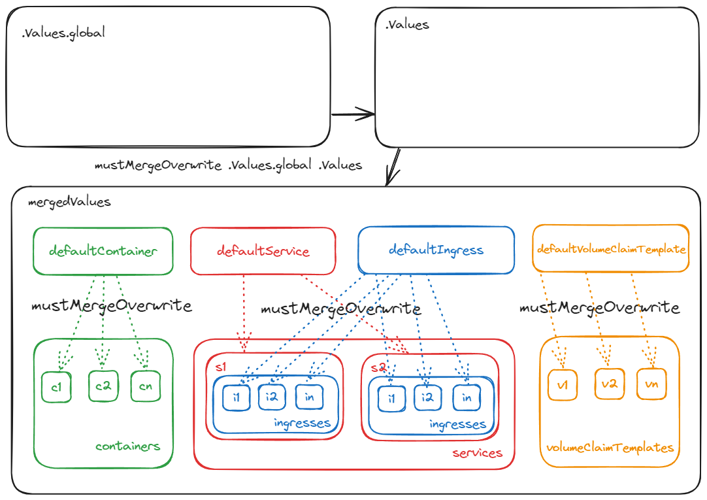

# tpl

Chart for templating kubernetes resources using values. Can be used as single dependency, as multiple dependencies, as is. See examples for use cases
## Values mergings process
1. Values merged using function mustMergreOverride
2. `.Values.global` merged into `.Values` resulting into `$mergedValues`
3. `$mergedValues.defaultContainer` merged into each container `$mergedValues.containers.x`
4. `$mergedValues.defaultService` merged into each service `$mergedValues.services.x`
5. `$mergedValues.defaultIngress` merged into each ingress `$mergedValues.services.x.ingresses.y`
6. `$mergedValues.defaultVolumeClaimTemplate` merged into each volumeClaimTemplate `$mergedValues.volumeClaimTemplates[x]`

## Values

| Key | Type | Default | Description |
|-----|------|---------|-------------|
| configMaps | object | `{}` | k8s configMaps. Use this to define configMaps |
| containers | object | `{}` | k8s containers. Use this to define containers |
| defaultContainer | object | `{}` | k8s container defaults. merged into each container |
| defaultIngress | object | `{}` | k8s ingress defaults. merged into each ingress |
| defaultService | object | `{}` | k8s service defaults. merged into each service |
| defaultVolumeClaimTemplate | object | `{}` | k8s volumeClaimTemplate defaults. merged into each volumeClaimTemplate |
| global.affinity | object | `{}` | k8s affinity |
| global.autoscaling | object | `{"behavior":{},"enabled":false,"maxReplicas":20,"metrics":[],"minReplicas":1}` | k8s hpa settings |
| global.defaultContainer | object | `{"args":null,"command":null,"configs":null,"env":null,"image":{"baseRepository":"","registry":"","repository":"","tag":""},"imagePullPolicy":"IfNotPresent","livenessProbe":null,"readinessProbe":null,"resources":null,"volumes":null}` | k8s container defaults. merged into each container |
| global.defaultIngress | object | `{"annotations":{},"className":"nginx","defaultPathType":"ImplementationSpecific","hosts":[],"paths":[{"path":"/"}],"tls":[]}` | k8s ingress defaults. merged into each ingress |
| global.defaultService | object | `{"annotations":{},"ports":[]}` | k8s service defaults. merged into each service |
| global.defaultVolumeClaimTemplate | object | `{"spec":{"accessModes":["ReadWriteOnce"]}}` | k8s volumeClaimTemplate defaults. merged into each volumeClaimTemplate |
| global.enableServiceLinks | bool | `false` | k8s enableServiceLinks |
| global.extraManifests | list | `[]` | Raw k8s manifests, rendered as is |
| global.fullnameOverride | string | `""` |  |
| global.imagePullSecrets | list | `[]` | k8s imagePullSecrets |
| global.kind | string | `"Deployment"` | can be StatefulSet or Deployment (default) |
| global.minReadySeconds | int | `0` | k8s sts minReadySeconds |
| global.nameOverride | string | `""` | chart nameOverride. should be used in multiple-dependency mode, for correct selectorLabels render |
| global.nodeSelector | object | `{}` | k8s nodeSelector |
| global.persistentVolumeClaimRetentionPolicy | object | `{}` | k8s sts persistentVolumeClaimRetentionPolicy |
| global.podAnnotations | object | `{}` | k8s podAnnotations |
| global.podManagementPolicy | string | `"OrderedReady"` | k8s sts podManagedPolicy |
| global.podSecurityContext | object | `{}` | k8s podSecurityContext |
| global.replicas | int | `1` | k8s replicas |
| global.restartPolicy | string | `""` | k8s terminationGracePeriodSeconds |
| global.serviceName | string | `""` | k8s sts serviceName |
| global.strategy | object | `{"type":"RollingUpdate"}` | k8s strategy |
| global.terminationGracePeriodSeconds | string | `nil` | k8s terminationGracePeriodSeconds |
| global.tolerations | list | `[]` | k8s tolerations |
| global.topologySpreadConstraints | list | `[]` | k8s topologySpreadConstraints |
| global.updateStrategy | object | `{}` | k8s sts updateStrategy |
| global.volumeClaimTemplates | list | `[]` | k8s sts volumeClaimTemplates |
| secrets | object | `{}` | k8s secrets. Use this to define secrets |
| services | object | `{}` | k8s services. Use this to define services |
